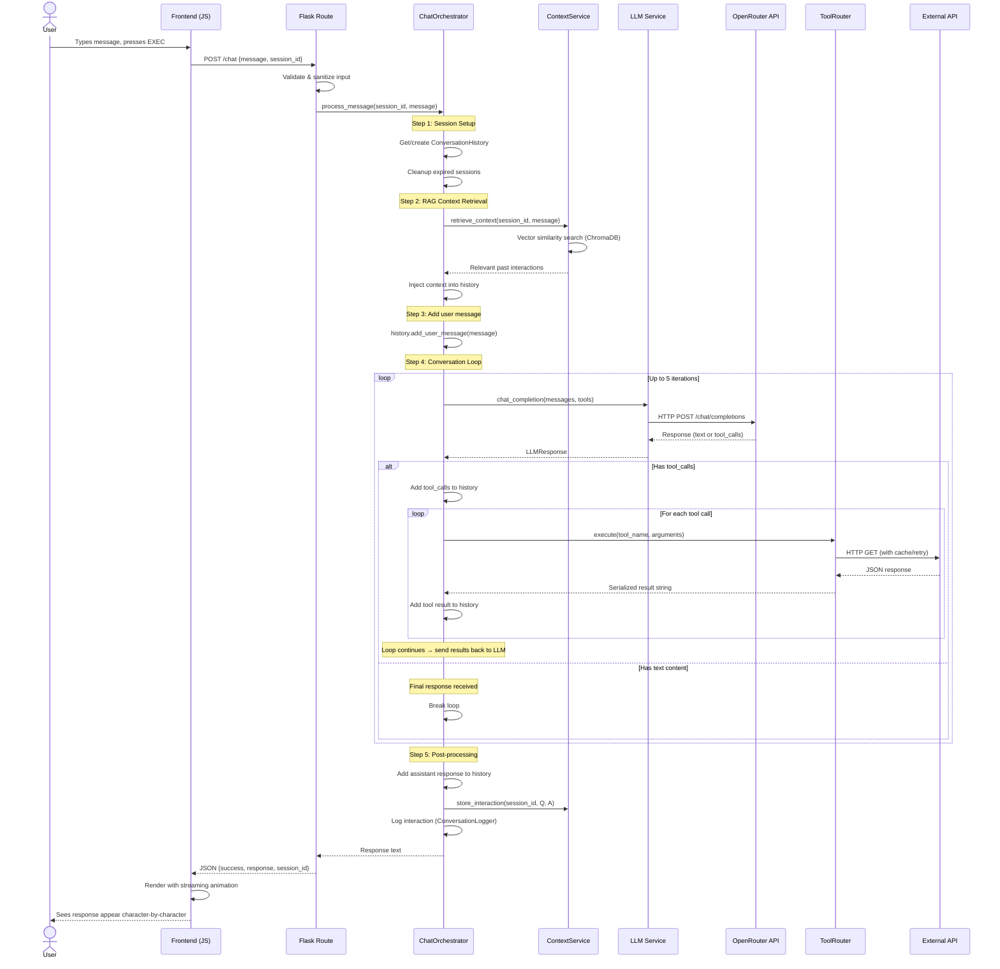
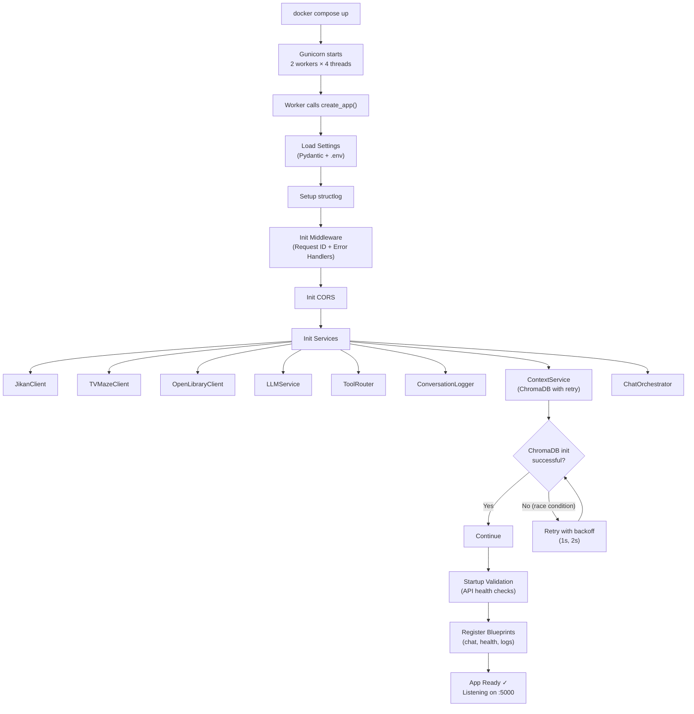
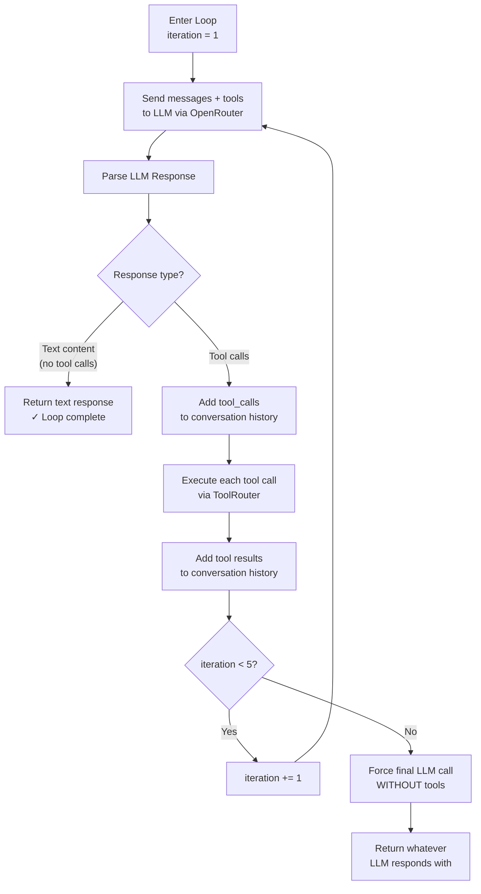
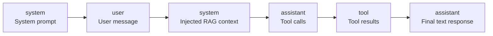
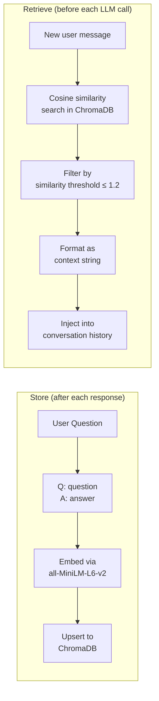
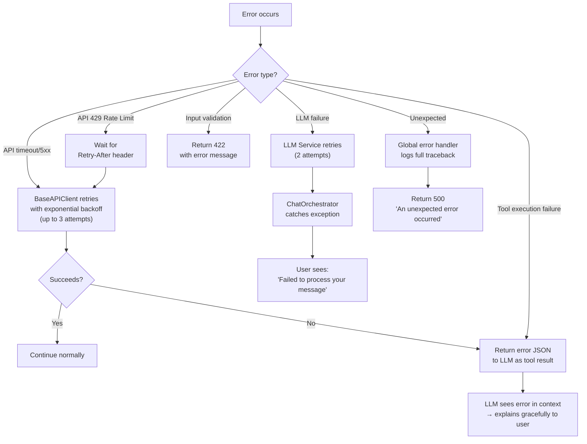
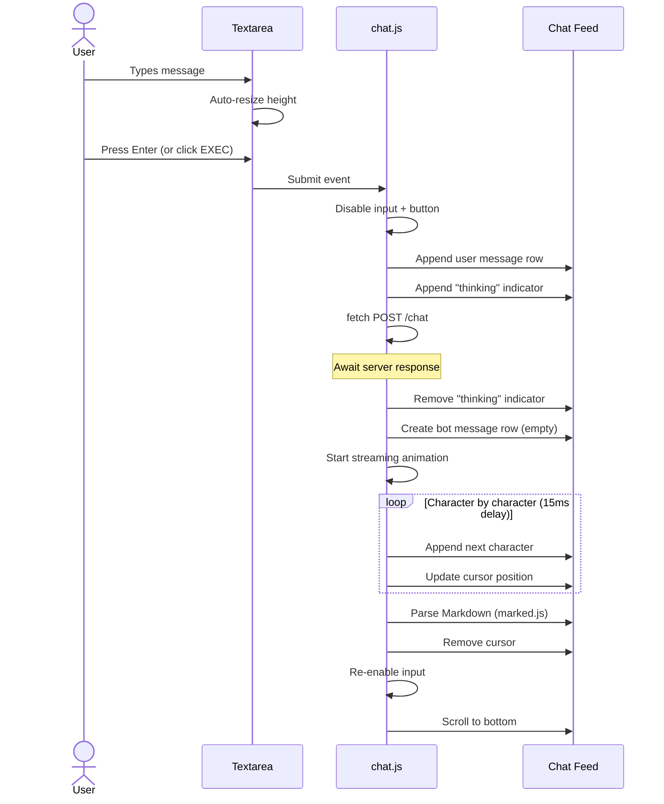

# EntertainBot — Control Flow & Request Lifecycle

## 1. End-to-End Request Lifecycle

This document traces the complete path of a user message from the browser to the final response.



---

## 2. Application Startup Flow



---

## 3. Tool Calling Loop (Detailed)

This is the core intelligence loop inside `ChatOrchestrator._run_conversation_loop()`:



### Tool Execution Detail

When the LLM returns a tool call like `search_anime(query="Death Note")`:

```
1. ToolRouter looks up "search_anime" in TOOL_MAP
   → ("jikan", "search_anime", {})

2. Gets the JikanClient instance and its search_anime method

3. Maps arguments (LLM names → client parameter names)
   → No mapping needed for search_anime

4. Calls jikan.search_anime(query="Death Note")
   → BaseAPIClient.get() handles caching, rate limiting, retry

5. Serializes result: list[AnimeData] → JSON string
   → {"results": [...], "count": 5}

6. Returns JSON string to Orchestrator
   → Added to history as tool result message
```

---

## 4. Available Tool Functions (13 Total)

### Jikan API (Anime/Manga)
| Tool | Client Method | Description |
|---|---|---|
| `search_anime` | `JikanClient.search_anime` | Search anime by name |
| `get_anime_details` | `JikanClient.get_anime_by_id` | Full anime profile by MAL ID |
| `search_manga` | `JikanClient.search_manga` | Search manga by name |
| `get_manga_details` | `JikanClient.get_manga_by_id` | Full manga profile by MAL ID |
| `get_top_anime` | `JikanClient.get_top_anime` | Top anime lists (airing, popular, etc.) |
| `get_seasonal_anime` | `JikanClient.get_season_anime` | Anime by season/year |

### TV Maze API
| Tool | Client Method | Description |
|---|---|---|
| `search_tv_shows` | `TVMazeClient.search_shows` | Search TV shows by name |
| `get_tv_show_details` | `TVMazeClient.get_show_with_details` | Full show profile with cast |
| `get_tv_episode` | `TVMazeClient.get_episode_by_number` | Specific episode by S/E number |
| `get_tv_schedule` | `TVMazeClient.get_schedule` | TV schedule for a date |

### Open Library API
| Tool | Client Method | Description |
|---|---|---|
| `search_books` | `OpenLibraryClient.search_books` | Search books by title/author |
| `get_book_by_isbn` | `OpenLibraryClient.get_edition_by_isbn` | Book edition by ISBN |
| `search_authors` | `OpenLibraryClient.search_authors` | Search authors by name |

---

## 5. Conversation History Management

### Message Types in History



### Trimming Strategy

When history exceeds `MAX_CONVERSATION_HISTORY` (default: 20 messages):
1. **Always keep**: System prompt (position 0)
2. **Keep**: Most recent N messages
3. **Preserve**: Tool call + result pairs (never orphaned)
4. **Drop**: Oldest user/assistant pairs first

---

## 6. RAG Context Flow



The context is injected as a system message just before the user's message, so the LLM naturally references it when generating a response.

---

## 7. Error Recovery Flow



---

## 8. Frontend Message Flow


