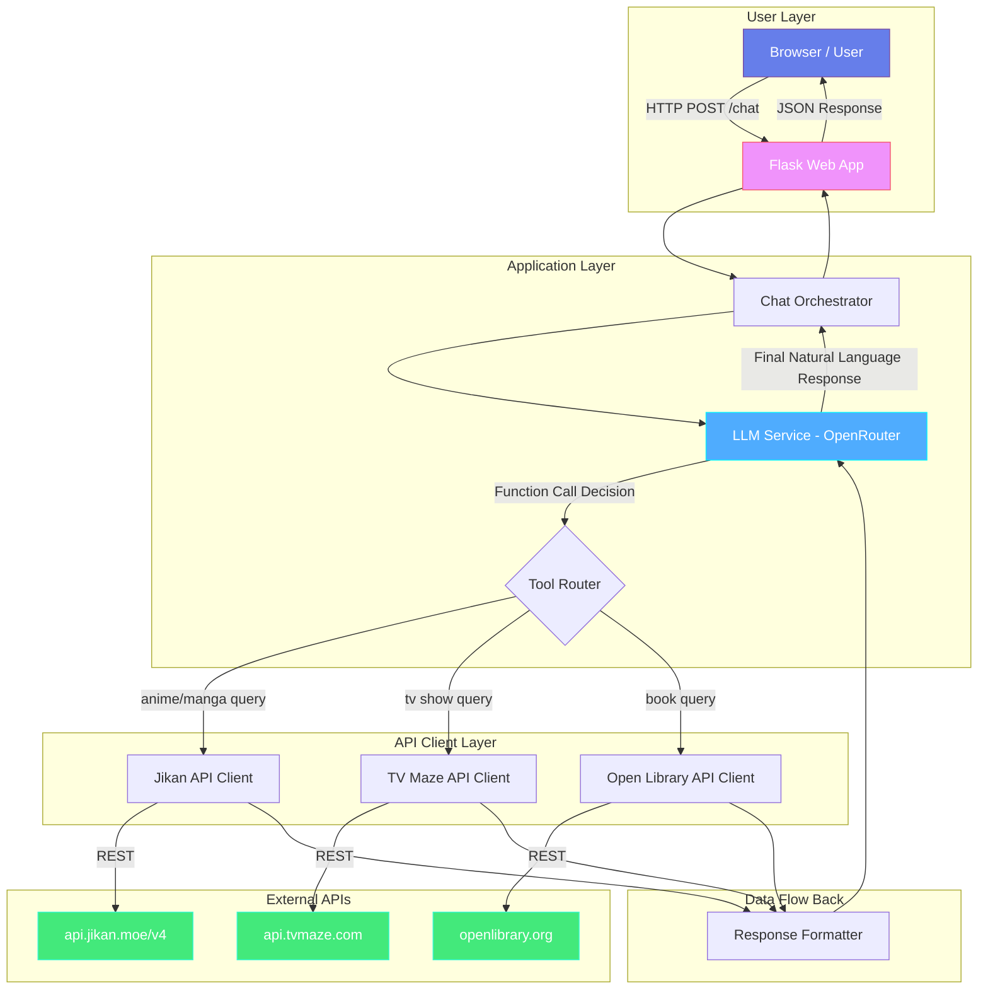
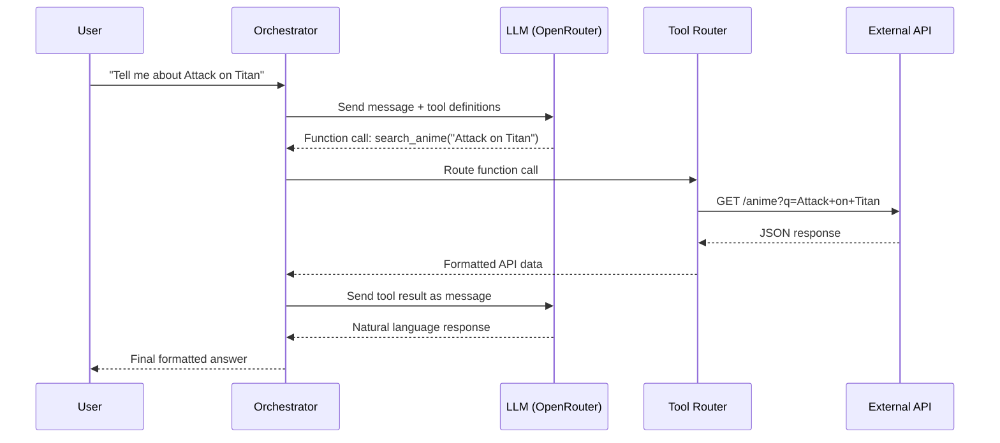

# 🤖 Entertainment & Books RAG Chatbot — Implementation Plan

> A production-grade chatbot powered by **OpenRouter LLM**, integrating **Jikan (Anime/Manga)**, **TV Maze (TV Shows)**, and **Open Library (Books)** APIs. Built with **Flask**, containerized with **Docker**, and tunneled via **ngrok**.

---

## Table of Contents

1. [Architecture Overview](#phase-1-architecture--project-scaffolding)
2. [Phase 1 — Architecture & Project Scaffolding](#phase-1-architecture--project-scaffolding)
3. [Phase 2 — Configuration & Environment](#phase-2-configuration--environment-management)
4. [Phase 2.5 — Production Infrastructure](#phase-25-production-infrastructure)
5. [Phase 3 — API Client Layer](#phase-3-api-client-layer)
6. [Phase 4 — LLM Integration & Function Calling](#phase-4-llm-integration--function-calling-via-openrouter)
7. [Phase 5 — Prompt Engineering & Orchestration](#phase-5-prompt-engineering--orchestration)
8. [Phase 6 — Flask Web Application](#phase-6-flask-web-application)
9. [Phase 7 — Dockerization](#phase-7-dockerization)
10. [Phase 8 — Deployment via ngrok](#phase-8-deployment-via-ngrok)
11. [Phase 9 — Testing & Validation](#phase-9-testing--validation)
12. [API Reference Cheat Sheet](#appendix-a-api-reference-cheat-sheet)

---

## High-Level Architecture



### Request Flow

```
User Query → Flask Endpoint → Chat Orchestrator → LLM (OpenRouter)
    ↓ (LLM decides which API tool to call via function calling)
    → Tool Router → API Client(s) → External API
    ↓ (API response returned)
    → Response Formatter → LLM (generates final answer)
    → Flask Response → User
```

---

## Phase 1: Architecture & Project Scaffolding

### Objective
Set up the project skeleton with clean separation of concerns, following production-level Python patterns.

### Directory Structure

```
chat-bot-rag/
├── docs/
│   └── plan.md                    # This file
├── app/
│   ├── __init__.py                # Flask app factory
│   ├── config.py                  # Configuration management (Pydantic Settings)
│   ├── routes/
│   │   ├── __init__.py
│   │   └── chat.py                # /chat endpoint (Blueprint)
│   ├── services/
│   │   ├── __init__.py
│   │   ├── llm_service.py         # OpenRouter LLM integration
│   │   ├── chat_orchestrator.py   # Main orchestration logic
│   │   └── tool_router.py         # Routes function calls to API clients
│   ├── api_clients/
│   │   ├── __init__.py
│   │   ├── base_client.py         # Abstract base with retry, rate-limit, timeout
│   │   ├── jikan_client.py        # Jikan (Anime/Manga) API client
│   │   ├── tvmaze_client.py       # TV Maze (TV Shows) API client
│   │   └── openlibrary_client.py  # Open Library (Books) API client
│   ├── models/
│   │   ├── __init__.py
│   │   ├── requests.py            # Pydantic request models
│   │   ├── responses.py           # Pydantic response models
│   │   └── api_schemas.py         # Pydantic models for external API data
│   ├── prompts/
│   │   ├── __init__.py
│   │   └── templates.py           # System prompts & function definitions
│   ├── middleware/
│   │   ├── __init__.py
│   │   ├── request_id.py          # Request ID injection middleware
│   │   └── error_handlers.py      # Global Flask error handlers
│   ├── utils/
│   │   ├── __init__.py
│   │   ├── logger.py              # Structured logging setup (structlog)
│   │   ├── exceptions.py          # Custom exception hierarchy
│   │   ├── sanitizer.py           # HTML stripping & input sanitization
│   │   └── cache.py               # In-memory TTL cache for API responses
│   ├── static/
│   │   ├── css/
│   │   │   └── style.css          # Chat UI styles
│   │   └── js/
│   │       └── chat.js            # Frontend chat logic
│   └── templates/
│       └── index.html             # Chat UI template
├── tests/
│   ├── __init__.py
│   ├── test_api_clients/
│   │   ├── __init__.py
│   │   ├── test_jikan_client.py
│   │   ├── test_tvmaze_client.py
│   │   └── test_openlibrary_client.py
│   ├── test_services/
│   │   ├── __init__.py
│   │   ├── test_llm_service.py
│   │   └── test_chat_orchestrator.py
│   └── conftest.py                # Shared pytest fixtures
├── .env.example                   # Environment variable template
├── .gitignore
├── .dockerignore
├── Dockerfile
├── docker-compose.yml
├── requirements.txt
├── run.py                         # Application entry point
└── README.md
```

### Key Decisions

| Decision | Choice | Rationale |
|----------|--------|-----------|
| Web Framework | Flask | Assignment requirement; lightweight, mature |
| Validation | Pydantic v2 | Assignment requirement; type-safe, fast |
| HTTP Client | `httpx` (async-capable) | Connection pooling, timeout control, retry hooks |
| LLM Provider | OpenRouter API | Access to multiple models via single API |
| Config | `pydantic-settings` | `.env` loading + validation in one step |
| Logging | `structlog` | Structured JSON logging, production-ready |
| Testing | `pytest` + `pytest-mock` | Standard Python testing stack |

### Deliverables
- [ ] **`git init`** — Initialize the Git repository
- [ ] **Create & activate virtual environment:**
  ```bash
  python3 -m venv venv
  source venv/bin/activate   # Linux/macOS
  pip install --upgrade pip
  ```
- [ ] Initialize project with the above directory structure
- [ ] Create `requirements.txt` with all dependencies
- [ ] **Install dependencies into venv:** `pip install -r requirements.txt`
- [ ] Create `.env.example` with required environment variables
- [ ] Create `.gitignore` and `.dockerignore` (ensure `venv/` is in `.gitignore`)

### Git Checkpoint
```bash
git add -A
git commit -m "chore: scaffold project structure with dependencies and config templates"
```

---

## Phase 2: Configuration & Environment Management

### Objective
Centralized, validated configuration using Pydantic Settings.

### File: `app/config.py`

```python
from pydantic_settings import BaseSettings
from pydantic import Field, field_validator

class Settings(BaseSettings):
    # Flask
    FLASK_ENV: str = "development"
    FLASK_DEBUG: bool = True
    SECRET_KEY: str = "change-me-in-production"

    # OpenRouter
    OPENROUTER_API_KEY: str
    OPENROUTER_BASE_URL: str = "https://openrouter.ai/api/v1"
    OPENROUTER_MODEL: str = "google/gemini-2.0-flash-001"

    # API Base URLs
    JIKAN_BASE_URL: str = "https://api.jikan.moe/v4"
    TVMAZE_BASE_URL: str = "https://api.tvmaze.com"
    OPENLIBRARY_BASE_URL: str = "https://openlibrary.org"

    # Rate Limiting Settings
    JIKAN_RATE_LIMIT: float = 1.0        # 1 req/sec (Jikan limits ~3/sec)
    TVMAZE_RATE_LIMIT: float = 0.5       # 2 req/sec (TVMaze allows 20/10sec)
    OPENLIBRARY_RATE_LIMIT: float = 1.0  # 1 req/sec (Open Library default)

    # HTTP Client Settings
    HTTP_TIMEOUT: int = 30
    HTTP_MAX_RETRIES: int = 3

    # Logging
    LOG_LEVEL: str = "INFO"              # DEBUG | INFO | WARNING | ERROR
    LOG_FORMAT: str = "json"             # "json" for production, "console" for dev

    # Conversation
    MAX_CONVERSATION_HISTORY: int = 20
    SESSION_TTL_SECONDS: int = 3600      # 1 hour — auto-cleanup idle sessions

    # Cache
    CACHE_TTL_SECONDS: int = 300         # 5 min TTL for API response cache
    CACHE_MAX_SIZE: int = 256            # Max cached entries

    class Config:
        env_file = ".env"
        env_file_encoding = "utf-8"
```

### Environment Variables (`.env.example`)

```env
# OpenRouter LLM
OPENROUTER_API_KEY=sk-or-v1-xxxxx
OPENROUTER_MODEL=google/gemini-2.0-flash-001

# Flask
FLASK_ENV=development
FLASK_DEBUG=true
SECRET_KEY=your-secret-key-here

# Optional: Override API base URLs
# JIKAN_BASE_URL=https://api.jikan.moe/v4
# TVMAZE_BASE_URL=https://api.tvmaze.com
# OPENLIBRARY_BASE_URL=https://openlibrary.org
```

### Deliverables
- [ ] Implement `app/config.py` with Pydantic Settings
- [ ] Create `.env.example` template
- [ ] Add validation for critical fields (API keys, URLs)

### Git Checkpoint
```bash
git add -A
git commit -m "feat: add configuration management with Pydantic Settings"
```

---

## Phase 2.5: Production Infrastructure

### Objective
Implement cross-cutting production concerns — structured logging, middleware, error handling, caching, input sanitization, health checks, and startup validation. These form the backbone that every other layer relies on.

---

### 2.5.1 Structured Logging (`app/utils/logger.py`)

Centralized logging configuration using `structlog` with automatic context injection.

**Features:**
- JSON output in production, colored console output in development
- Automatic `request_id` binding for request correlation
- Automatic `timestamp`, `level`, `logger` fields on every log line
- Log every external API call with endpoint, status code, and duration
- Log every LLM call with model, token usage, and duration
- **Never** log API keys, secrets, or full response bodies

```python
import structlog
import logging

def setup_logging(log_level: str = "INFO", log_format: str = "json") -> None:
    """Configure structlog for the application.

    Args:
        log_level: Logging level (DEBUG, INFO, WARNING, ERROR).
        log_format: Output format — 'json' for production, 'console' for dev.
    """
    shared_processors = [
        structlog.contextvars.merge_contextvars,     # picks up request_id
        structlog.processors.add_log_level,
        structlog.processors.TimeStamper(fmt="iso"),
        structlog.processors.StackInfoRenderer(),
        structlog.processors.format_exc_info,
    ]

    if log_format == "json":
        renderer = structlog.processors.JSONRenderer()
    else:
        renderer = structlog.dev.ConsoleRenderer(colors=True)

    structlog.configure(
        processors=[*shared_processors, renderer],
        wrapper_class=structlog.make_filtering_bound_logger(
            getattr(logging, log_level.upper())
        ),
        context_class=dict,
        logger_factory=structlog.PrintLoggerFactory(),
        cache_logger_on_first_use=True,
    )
```

**Usage across the app:**
```python
import structlog
logger = structlog.get_logger(__name__)

# In an API client
logger.info("api_request", client="jikan", endpoint="/anime", query=query)
logger.info("api_response", client="jikan", status=200, duration_ms=145)

# In the LLM service
logger.info("llm_request", model="gemini-2.0-flash", messages_count=5)
logger.info("llm_response", model="gemini-2.0-flash", tool_calls=2, duration_ms=820)

# In error paths
logger.error("api_error", client="tvmaze", status=429, message="Rate limited")
```

---

### 2.5.2 Request ID Middleware (`app/middleware/request_id.py`)

Injects a unique `X-Request-ID` into every incoming request, enabling log correlation across the full request lifecycle.

```python
import uuid
import structlog
from flask import Flask, request, g


def init_request_id_middleware(app: Flask) -> None:
    """Register before/after hooks for request ID tracing."""

    @app.before_request
    def inject_request_id():
        request_id = request.headers.get("X-Request-ID", str(uuid.uuid4()))
        g.request_id = request_id
        structlog.contextvars.clear_contextvars()
        structlog.contextvars.bind_contextvars(request_id=request_id)

    @app.after_request
    def attach_request_id(response):
        response.headers["X-Request-ID"] = g.get("request_id", "unknown")
        return response
```

---

### 2.5.3 Global Error Handlers (`app/middleware/error_handlers.py`)

Consistent JSON error responses for all failure modes.

```python
from flask import Flask, jsonify
from app.utils.exceptions import ChatBotError, APIClientError, LLMServiceError
import structlog

logger = structlog.get_logger(__name__)


def register_error_handlers(app: Flask) -> None:
    """Register global error handlers."""

    @app.errorhandler(400)
    def bad_request(e):
        return jsonify({"success": False, "error": {"message": "Bad request", "code": 400}}), 400

    @app.errorhandler(404)
    def not_found(e):
        return jsonify({"success": False, "error": {"message": "Not found", "code": 404}}), 404

    @app.errorhandler(422)
    def validation_error(e):
        return jsonify({"success": False, "error": {"message": str(e), "code": 422}}), 422

    @app.errorhandler(429)
    def rate_limited(e):
        return jsonify({"success": False, "error": {"message": "Too many requests", "code": 429}}), 429

    @app.errorhandler(500)
    def internal_error(e):
        logger.error("unhandled_error", error=str(e), exc_info=True)
        return jsonify({"success": False, "error": {"message": "Internal server error", "code": 500}}), 500

    @app.errorhandler(ChatBotError)
    def handle_chatbot_error(e):
        logger.warning("chatbot_error", error=str(e), error_type=type(e).__name__)
        status = getattr(e, "status_code", 500) or 500
        return jsonify({"success": False, "error": {"message": str(e), "code": status}}), status
```

---

### 2.5.4 Input Sanitization (`app/utils/sanitizer.py`)

Prevents prompt injection and cleans HTML from API responses.

```python
import re
from markupsafe import escape


def strip_html(text: str | None) -> str:
    """Remove all HTML tags from a string (e.g., TV Maze summaries)."""
    if not text:
        return ""
    return re.sub(r"<[^>]+>", "", text).strip()


def sanitize_user_input(text: str) -> str:
    """Sanitize user input before sending to the LLM.

    - Strips leading/trailing whitespace
    - Escapes HTML entities
    - Truncates to max length
    """
    text = text.strip()
    text = str(escape(text))
    return text[:2000]  # Hard limit
```

---

### 2.5.5 In-Memory TTL Cache (`app/utils/cache.py`)

Simple thread-safe cache with TTL eviction for repeated API queries.

```python
import time
import threading
from typing import Any


class TTLCache:
    """Thread-safe in-memory cache with TTL expiration."""

    def __init__(self, ttl_seconds: int = 300, max_size: int = 256):
        self._store: dict[str, tuple[float, Any]] = {}
        self._ttl = ttl_seconds
        self._max_size = max_size
        self._lock = threading.Lock()

    def get(self, key: str) -> Any | None:
        """Get value if exists and not expired."""
        with self._lock:
            if key in self._store:
                expiry, value = self._store[key]
                if time.monotonic() < expiry:
                    return value
                del self._store[key]
        return None

    def set(self, key: str, value: Any) -> None:
        """Set value with TTL."""
        with self._lock:
            if len(self._store) >= self._max_size:
                self._evict_expired()
            self._store[key] = (time.monotonic() + self._ttl, value)

    def _evict_expired(self) -> None:
        """Remove all expired entries."""
        now = time.monotonic()
        self._store = {k: v for k, v in self._store.items() if v[0] > now}
```

**Usage in API clients:**
```python
# In base_client.py
def _request(self, method: str, endpoint: str, params: dict) -> dict:
    cache_key = f"{method}:{endpoint}:{sorted(params.items())}"
    cached = self._cache.get(cache_key)
    if cached:
        logger.debug("cache_hit", endpoint=endpoint)
        return cached

    response = self._do_request(method, endpoint, params)
    self._cache.set(cache_key, response)
    return response
```

---

### 2.5.6 Health Check Endpoint (`app/routes/health.py`)

Exposes application and dependency health status for Docker `HEALTHCHECK` and monitoring.

```python
from flask import Blueprint, jsonify, current_app

health_bp = Blueprint("health", __name__)


@health_bp.route("/health", methods=["GET"])
def health_check():
    """Application health check.

    Returns:
        200 with status of each dependency.
    """
    checks = {
        "status": "healthy",
        "dependencies": {
            "jikan_api": _check_api("jikan"),
            "tvmaze_api": _check_api("tvmaze"),
            "openlibrary_api": _check_api("openlibrary"),
            "openrouter_llm": _check_api("openrouter"),
        }
    }
    status_code = 200 if all(v == "ok" for v in checks["dependencies"].values()) else 503
    return jsonify(checks), status_code
```

---

### 2.5.7 Session Cleanup & TTL

Conversation sessions accumulate in memory. A background cleanup routine prevents unbounded memory growth.

```python
import threading
import time

class SessionManager:
    """Manages conversation sessions with automatic TTL cleanup."""

    def __init__(self, ttl_seconds: int = 3600):
        self._sessions: dict[str, dict] = {}
        self._ttl = ttl_seconds
        self._lock = threading.Lock()
        self._start_cleanup_thread()

    def get_or_create(self, session_id: str) -> list[dict]:
        """Get or create a session's message history."""
        with self._lock:
            if session_id not in self._sessions:
                self._sessions[session_id] = {"messages": [], "last_active": time.monotonic()}
            else:
                self._sessions[session_id]["last_active"] = time.monotonic()
            return self._sessions[session_id]["messages"]

    def _cleanup(self) -> None:
        """Remove expired sessions periodically."""
        while True:
            time.sleep(300)  # Run every 5 minutes
            now = time.monotonic()
            with self._lock:
                expired = [sid for sid, s in self._sessions.items() if now - s["last_active"] > self._ttl]
                for sid in expired:
                    del self._sessions[sid]
                if expired:
                    logger.info("sessions_cleaned", count=len(expired))

    def _start_cleanup_thread(self) -> None:
        t = threading.Thread(target=self._cleanup, daemon=True)
        t.start()
```

---

### 2.5.8 Startup Validation

Verify all critical dependencies are reachable before accepting traffic.

```python
def validate_startup(settings: Settings) -> None:
    """Run at app startup to fail fast if dependencies are unreachable."""
    logger.info("startup_validation", phase="begin")

    # 1. Verify OpenRouter API key is set
    assert settings.OPENROUTER_API_KEY, "OPENROUTER_API_KEY is not set"

    # 2. Verify external APIs are reachable (non-blocking, log warnings only)
    for name, url in [
        ("Jikan", f"{settings.JIKAN_BASE_URL}"),
        ("TVMaze", f"{settings.TVMAZE_BASE_URL}/shows/1"),
        ("OpenLibrary", f"{settings.OPENLIBRARY_BASE_URL}/search.json?q=test&limit=1"),
    ]:
        try:
            resp = httpx.get(url, timeout=10)
            logger.info("startup_check", api=name, status=resp.status_code)
        except Exception as e:
            logger.warning("startup_check_failed", api=name, error=str(e))

    logger.info("startup_validation", phase="complete")
```

---

### 2.5.9 CORS Configuration

```python
from flask_cors import CORS

def init_cors(app: Flask) -> None:
    """Enable CORS for the application."""
    CORS(app, resources={
        r"/chat": {"origins": "*"},
        r"/health": {"origins": "*"},
    })
```

> [!NOTE]
> `flask-cors` is included in `requirements.txt`.

---

### Deliverables
- [ ] Implement `app/utils/logger.py` — structured logging with `structlog`
- [ ] Implement `app/middleware/request_id.py` — request ID injection
- [ ] Implement `app/middleware/error_handlers.py` — global JSON error handlers
- [ ] Implement `app/utils/sanitizer.py` — HTML stripping + input sanitization
- [ ] Implement `app/utils/cache.py` — TTL-based in-memory response cache
- [ ] Implement `app/routes/health.py` — `/health` endpoint
- [ ] Implement session cleanup with TTL in `SessionManager`
- [ ] Implement startup validation in `app/__init__.py`
- [ ] Configure CORS

### Git Checkpoint
```bash
git add -A
git commit -m "feat: add production infrastructure — logging, middleware, cache, health checks"
```

---

## Phase 3: API Client Layer

### Objective
Build robust, production-grade API clients with retry logic, rate limiting, timeouts, and structured error handling.

---

### 3.1 Base Client (`app/api_clients/base_client.py`)

Abstract base class that all API clients inherit from.

**Features:**
- Connection pooling via `httpx.Client` (persistent session)
- Automatic retry with exponential backoff (on 429, 500, 502, 503, 504)
- Rate limiting (per-client configurable delay between requests)
- Timeout configuration (connect + read timeouts)
- Structured logging for all requests/responses
- Custom exception hierarchy

```python
# Pseudocode structure
class BaseAPIClient(ABC):
    def __init__(self, base_url: str, rate_limit: float, timeout: int):
        self.client = httpx.Client(base_url=base_url, timeout=timeout)
        self.rate_limit = rate_limit
        self._last_request_time = 0

    def _rate_limit_wait(self):
        """Enforce minimum delay between requests."""

    def _request(self, method: str, endpoint: str, params: dict) -> dict:
        """Make HTTP request with retry logic."""

    @abstractmethod
    def health_check(self) -> bool:
        """Verify API is reachable."""
```

---

### 3.2 Jikan API Client (`app/api_clients/jikan_client.py`)

> **Jikan API v4** — Unofficial MyAnimeList REST API (no auth required)
> Base URL: `https://api.jikan.moe/v4`
> Rate Limit: ~3 requests/second, 60 requests/minute

**Endpoints to Implement:**

| Method | Endpoint | Purpose | Example |
|--------|----------|---------|---------|
| `search_anime(query, limit)` | `GET /anime?q={query}&limit={limit}` | Search anime by name | `/anime?q=Naruto&limit=5` |
| `get_anime_by_id(id)` | `GET /anime/{id}/full` | Full anime details | `/anime/20/full` |
| `search_manga(query, limit)` | `GET /manga?q={query}&limit={limit}` | Search manga by name | `/manga?q=One Piece&limit=5` |
| `get_manga_by_id(id)` | `GET /manga/{id}/full` | Full manga details | `/manga/13/full` |
| `get_top_anime(filter, limit)` | `GET /top/anime?filter={filter}&limit={limit}` | Top anime lists | `/top/anime?filter=airing&limit=10` |
| `get_top_manga(filter, limit)` | `GET /top/manga?filter={filter}&limit={limit}` | Top manga lists | `/top/manga?filter=publishing&limit=10` |
| `get_anime_characters(id)` | `GET /anime/{id}/characters` | Anime character list | `/anime/20/characters` |
| `get_season_anime(year, season)` | `GET /seasons/{year}/{season}` | Seasonal anime | `/seasons/2024/winter` |
| `get_anime_recommendations(id)` | `GET /anime/{id}/recommendations` | Similar anime | `/anime/1/recommendations` |

**Key Response Fields to Extract:**

```python
class AnimeData(BaseModel):
    mal_id: int
    title: str
    title_english: Optional[str]
    synopsis: Optional[str]
    score: Optional[float]
    episodes: Optional[int]
    status: str              # "Finished Airing", "Currently Airing", etc.
    rating: Optional[str]    # "PG-13", "R", etc.
    genres: List[str]
    studios: List[str]
    year: Optional[int]
    images: dict             # Contains JPG/WebP URLs
    url: str                 # MAL URL
```

---

### 3.3 TV Maze API Client (`app/api_clients/tvmaze_client.py`)

> **TV Maze API** — Free TV show data (no auth required)
> Base URL: `https://api.tvmaze.com`
> Rate Limit: 20 requests per 10 seconds per IP

**Endpoints to Implement:**

| Method | Endpoint | Purpose | Example |
|--------|----------|---------|---------|
| `search_shows(query)` | `GET /search/shows?q={query}` | Fuzzy search shows | `/search/shows?q=breaking+bad` |
| `get_show(id)` | `GET /shows/{id}` | Show main info | `/shows/1` |
| `get_show_with_details(id)` | `GET /shows/{id}?embed[]=episodes&embed[]=cast` | Show with episodes + cast | `/shows/1?embed[]=episodes&embed[]=cast` |
| `get_show_episodes(id)` | `GET /shows/{id}/episodes` | All episodes of a show | `/shows/1/episodes` |
| `get_show_cast(id)` | `GET /shows/{id}/cast` | Main cast list | `/shows/1/cast` |
| `get_episode_by_number(show_id, season, episode)` | `GET /shows/{id}/episodebynumber?season={s}&number={e}` | Specific episode | `/shows/1/episodebynumber?season=1&number=1` |
| `get_schedule(country, date)` | `GET /schedule?country={cc}&date={date}` | Airing schedule | `/schedule?country=US&date=2024-01-15` |
| `search_people(query)` | `GET /search/people?q={query}` | Search actors/crew | `/search/people?q=bryan+cranston` |

**Key Response Fields to Extract:**

```python
class TVShowData(BaseModel):
    id: int
    name: str
    summary: Optional[str]      # HTML — needs stripping
    genres: List[str]
    status: str                 # "Running", "Ended", etc.
    premiered: Optional[str]    # Date string
    ended: Optional[str]
    rating: Optional[float]     # Average rating
    network: Optional[str]      # Network name
    schedule: Optional[dict]    # Day/time
    image: Optional[dict]       # Medium/original URLs
    url: str                    # TVMaze URL
```

> [!IMPORTANT]
> TV Maze returns HTML in the `summary` field. We must strip HTML tags before sending to the LLM. Use `re.sub(r'<[^>]+>', '', summary)` or `BeautifulSoup` for sanitization.

---

### 3.4 Open Library API Client (`app/api_clients/openlibrary_client.py`)

> **Open Library API** — Free book data (no auth required)
> Base URL: `https://openlibrary.org`
> Rate Limit: 1 req/sec (default), 3 req/sec (with User-Agent)

**Endpoints to Implement:**

| Method | Endpoint | Purpose | Example |
|--------|----------|---------|---------|
| `search_books(query, limit)` | `GET /search.json?q={query}&limit={limit}` | Search books by title/author/keyword | `/search.json?q=lord+of+the+rings&limit=5` |
| `search_by_author(author, limit)` | `GET /search.json?author={author}&limit={limit}` | Books by specific author | `/search.json?author=tolkien&limit=5` |
| `get_work(work_id)` | `GET /works/{id}.json` | Work details | `/works/OL27448W.json` |
| `get_edition_by_isbn(isbn)` | `GET /isbn/{isbn}.json` | Edition by ISBN | `/isbn/9780140328721.json` |
| `get_author(author_id)` | `GET /authors/{id}.json` | Author details | `/authors/OL26320A.json` |
| `search_authors(query)` | `GET /search/authors.json?q={query}` | Search authors | `/search/authors.json?q=twain` |
| `get_cover_url(cover_id, size)` | Construct URL | Book cover image URL | `https://covers.openlibrary.org/b/id/{cover_id}-{size}.jpg` |

**Key Response Fields to Extract:**

```python
class BookData(BaseModel):
    title: str
    author_name: List[str]
    first_publish_year: Optional[int]
    edition_count: Optional[int]
    isbn: Optional[List[str]]
    subject: Optional[List[str]]
    cover_id: Optional[int]       # For cover URL construction
    key: str                      # Open Library Work key
    ratings_average: Optional[float]
    number_of_pages: Optional[int]
```

> [!TIP]
> Always send the `User-Agent: ChatBotRAG (contact@example.com)` header to Open Library for 3x rate limit boost.

### Deliverables
- [ ] Implement `base_client.py` with retry, rate-limiting, and error handling
- [ ] Implement `jikan_client.py` with all listed endpoints
- [ ] Implement `tvmaze_client.py` with all listed endpoints  
- [ ] Implement `openlibrary_client.py` with all listed endpoints
- [ ] Create Pydantic models for API response validation in `api_schemas.py`

### Git Checkpoint
```bash
git add -A
git commit -m "feat: implement API client layer for Jikan, TV Maze, and Open Library"
```

---

## Phase 4: LLM Integration & Function Calling via OpenRouter

### Objective
Integrate the OpenRouter API to power the chatbot with function calling (tool use) capabilities.

### OpenRouter API Details

> **Base URL:** `https://openrouter.ai/api/v1`
> **Auth:** Bearer token in `Authorization` header
> **Protocol:** OpenAI-compatible Chat Completions API

### File: `app/services/llm_service.py`

**Responsibilities:**
1. Send chat completion requests to OpenRouter
2. Define function/tool schemas for all three API clients
3. Parse function call responses and extract tool invocations
4. Handle multi-turn conversations with message history

**OpenRouter Request Format:**

```python
{
    "model": "google/gemini-2.0-flash-001",
    "messages": [
        {"role": "system", "content": "...system prompt..."},
        {"role": "user", "content": "What anime is similar to Naruto?"},
    ],
    "tools": [
        {
            "type": "function",
            "function": {
                "name": "search_anime",
                "description": "Search for anime by name or keyword",
                "parameters": {
                    "type": "object",
                    "properties": {
                        "query": {"type": "string", "description": "Anime title or keyword"},
                        "limit": {"type": "integer", "description": "Max results (1-10)", "default": 5}
                    },
                    "required": ["query"]
                }
            }
        },
        # ... more tools
    ],
    "tool_choice": "auto"
}
```

### Tool/Function Definitions (13 Functions)

```python
TOOL_DEFINITIONS = [
    # ── Jikan (Anime/Manga) ──
    {
        "name": "search_anime",
        "description": "Search for anime series by name, keyword, or phrase. Use when the user asks about a specific anime or wants to find anime.",
        "parameters": { "query": str, "limit": int }
    },
    {
        "name": "get_anime_details",
        "description": "Get full details about an anime by its MyAnimeList ID. Use after search to get deeper info.",
        "parameters": { "anime_id": int }
    },
    {
        "name": "search_manga",
        "description": "Search for manga by name, keyword, or phrase.",
        "parameters": { "query": str, "limit": int }
    },
    {
        "name": "get_manga_details",
        "description": "Get full details about a manga by its MyAnimeList ID.",
        "parameters": { "manga_id": int }
    },
    {
        "name": "get_top_anime",
        "description": "Get top-rated or trending anime. Filters: 'airing', 'upcoming', 'bypopularity', 'favorite'.",
        "parameters": { "filter": str, "limit": int }
    },
    {
        "name": "get_seasonal_anime",
        "description": "Get anime airing in a specific season and year.",
        "parameters": { "year": int, "season": str }
    },

    # ── TV Maze (TV Shows) ──
    {
        "name": "search_tv_shows",
        "description": "Search for TV shows by name. Covers all TV series including western, Asian dramas, etc.",
        "parameters": { "query": str }
    },
    {
        "name": "get_tv_show_details",
        "description": "Get full details about a TV show including cast and episodes.",
        "parameters": { "show_id": int }
    },
    {
        "name": "get_tv_episode",
        "description": "Get a specific episode of a TV show by season and episode number.",
        "parameters": { "show_id": int, "season": int, "episode": int }
    },
    {
        "name": "get_tv_schedule",
        "description": "Get TV shows airing today or on a specific date in a country.",
        "parameters": { "country": str, "date": str }
    },

    # ── Open Library (Books) ──
    {
        "name": "search_books",
        "description": "Search for books by title, author, or general keyword.",
        "parameters": { "query": str, "limit": int }
    },
    {
        "name": "get_book_by_isbn",
        "description": "Get book details by ISBN (10 or 13 digit).",
        "parameters": { "isbn": str }
    },
    {
        "name": "search_authors",
        "description": "Search for book authors by name.",
        "parameters": { "query": str }
    },
]
```

### LLM Response Handling Flow



### Deliverables
- [ ] Implement `llm_service.py` with OpenRouter integration
- [ ] Define all 13 tool/function schemas in `prompts/templates.py`
- [ ] Implement function call parsing and multi-step tool calling
- [ ] Handle conversation history management

### Git Checkpoint
```bash
git add -A
git commit -m "feat: integrate OpenRouter LLM with function calling support"
```

---

## Phase 5: Prompt Engineering & Orchestration

### Objective
Design effective system prompts and implement the main orchestration logic that ties LLM + API clients together.

### 5.1 System Prompt Design (`app/prompts/templates.py`)

```python
SYSTEM_PROMPT = """You are an intelligent entertainment and books assistant.
You can help users discover and learn about:

🎌 **Anime & Manga** (powered by MyAnimeList via Jikan API)
- Search for anime/manga by name
- Get detailed information (synopsis, ratings, episodes, genres, studios)
- Find top-rated, currently airing, or seasonal anime
- Get character lists and recommendations

📺 **TV Shows** (powered by TV Maze API)
- Search for TV shows (western series, dramas, etc.)
- Get show details including cast, episodes, and ratings
- Find specific episodes by season/episode number
- Check today's airing schedule

📚 **Books** (powered by Open Library API)
- Search for books by title, author, or keyword
- Get book details by ISBN
- Find information about authors
- Discover books by subject/genre

## Guidelines:
1. ALWAYS use the appropriate tool/function to fetch real data. Never make up information.
2. When the user mentions an anime, manga, TV show, or book — search for it first.
3. Present information in a clean, organized format with key details highlighted.
4. If a search returns multiple results, present the top matches and ask for clarification if needed.
5. You can handle follow-up questions using context from previous messages.
6. If the query doesn't relate to anime, manga, TV shows, or books, politely redirect.
7. Always cite the source (MyAnimeList, TV Maze, or Open Library) in your response.
8. When showing ratings, use a ★ star format for visual appeal.
"""
```

### 5.2 Chat Orchestrator (`app/services/chat_orchestrator.py`)

The orchestrator is the central brain:

```python
class ChatOrchestrator:
    """
    Main orchestration service.
    Manages the conversation loop between user → LLM → tools → LLM → response.
    """

    def __init__(self, llm_service, tool_router):
        self.llm_service = llm_service
        self.tool_router = tool_router
        self.conversations: dict[str, list] = {}  # session_id -> messages

    async def process_message(self, session_id: str, user_message: str) -> str:
        """
        1. Append user message to conversation history
        2. Send to LLM with tool definitions
        3. If LLM returns tool_calls:
           a. Execute each tool via tool_router
           b. Append tool results to conversation
           c. Send updated conversation back to LLM
           d. Repeat until LLM returns a text response (max 3 iterations)
        4. Return final text response
        """
```

### 5.3 Tool Router (`app/services/tool_router.py`)

```python
class ToolRouter:
    """Routes function calls from the LLM to the appropriate API client."""

    TOOL_MAP = {
        # Jikan
        "search_anime":       ("jikan", "search_anime"),
        "get_anime_details":  ("jikan", "get_anime_by_id"),
        "search_manga":       ("jikan", "search_manga"),
        "get_manga_details":  ("jikan", "get_manga_by_id"),
        "get_top_anime":      ("jikan", "get_top_anime"),
        "get_seasonal_anime": ("jikan", "get_season_anime"),
        # TV Maze
        "search_tv_shows":      ("tvmaze", "search_shows"),
        "get_tv_show_details":  ("tvmaze", "get_show_with_details"),
        "get_tv_episode":       ("tvmaze", "get_episode_by_number"),
        "get_tv_schedule":      ("tvmaze", "get_schedule"),
        # Open Library
        "search_books":    ("openlibrary", "search_books"),
        "get_book_by_isbn": ("openlibrary", "get_edition_by_isbn"),
        "search_authors":  ("openlibrary", "search_authors"),
    }

    def execute_tool(self, tool_name: str, arguments: dict) -> str:
        """Execute the appropriate API call and return formatted results."""
```

### Deliverables
- [ ] Design and implement system prompt in `prompts/templates.py`
- [ ] Implement `chat_orchestrator.py` with multi-turn tool calling loop
- [ ] Implement `tool_router.py` that maps function names to API client methods
- [ ] Add conversation history management with configurable max length

### Git Checkpoint
```bash
git add -A
git commit -m "feat: add prompt engineering, chat orchestrator, and tool router"
```

---

## Phase 6: Flask Web Application

### Objective
Build a polished, responsive chat UI with Flask.

### 6.1 Flask App Factory (`app/__init__.py`)

```python
def create_app() -> Flask:
    """Application factory pattern."""
    app = Flask(__name__)

    # Load config
    settings = Settings()
    app.config.from_object(settings)

    # ── Production infrastructure (from Phase 2.5) ──
    setup_logging(settings.LOG_LEVEL, settings.LOG_FORMAT)
    init_request_id_middleware(app)
    register_error_handlers(app)
    init_cors(app)

    # Initialize services (API clients, LLM, orchestrator)
    init_services(app, settings)

    # Startup validation (fail fast if deps are down)
    validate_startup(settings)

    # Register blueprints
    from app.routes.chat import chat_bp
    from app.routes.health import health_bp
    app.register_blueprint(chat_bp)
    app.register_blueprint(health_bp)

    logger.info("app_started", env=settings.FLASK_ENV, model=settings.OPENROUTER_MODEL)
    return app
```

### 6.2 Chat Blueprint (`app/routes/chat.py`)

```python
chat_bp = Blueprint("chat", __name__)

@chat_bp.route("/")
def index():
    """Render the chat UI."""
    return render_template("index.html")

@chat_bp.route("/chat", methods=["POST"])
def chat():
    """
    Process chat message.
    Request:  { "message": "Tell me about Naruto", "session_id": "abc123" }
    Response: { "response": "...", "session_id": "abc123" }
    """
```

### 6.3 Frontend UI (`app/templates/index.html` + `static/`)

**Design Specifications:**

| Element | Specification |
|---------|--------------|
| Layout | Centered chat container, max 800px width |
| Theme | Dark mode with accent colors per API domain |
| Colors | Anime = `#FF6B6B`, TV = `#4ECDC4`, Books = `#45B7D1` |
| Font | Inter (Google Fonts) |
| Messages | User: right-aligned bubble, Bot: left-aligned bubble |
| Input | Fixed bottom bar with send button |
| Loading | Animated typing indicator ("thinking...") |
| Responsive | Works on mobile (min-width: 320px) |

**Features:**
- Session-based conversation (UUID generated client-side)
- Auto-scroll to latest message
- Markdown rendering in bot responses
- Loading state while waiting for response
- Error display for failed requests
- Welcome message explaining capabilities

### Deliverables
- [ ] Implement Flask app factory with blueprint registration
- [ ] Create `/chat` POST endpoint with Pydantic validation
- [ ] Build responsive chat UI (`index.html`, `style.css`, `chat.js`)
- [ ] Add session management (UUID-based)
- [ ] Add loading states and error handling in frontend

### Git Checkpoint
```bash
git add -A
git commit -m "feat: build Flask web application with responsive chat UI"
```

---

## Phase 7: Dockerization

### Objective
Containerize the application with a production-ready Docker setup.

### 7.1 Dockerfile

```dockerfile
# ── Stage 1: Build ──
FROM python:3.11-slim AS builder

WORKDIR /app

# Install dependencies first (layer caching)
COPY requirements.txt .
RUN pip install --no-cache-dir --user -r requirements.txt

# ── Stage 2: Runtime ──
FROM python:3.11-slim AS runtime

WORKDIR /app

# Create non-root user
RUN groupadd -r appuser && useradd -r -g appuser appuser

# Copy installed packages from builder
COPY --from=builder /root/.local /home/appuser/.local
ENV PATH=/home/appuser/.local/bin:$PATH

# Copy application code
COPY . .

# Set ownership
RUN chown -R appuser:appuser /app

USER appuser

# Expose port
EXPOSE 5000

# Health check
HEALTHCHECK --interval=30s --timeout=10s --retries=3 \
    CMD python -c "import urllib.request; urllib.request.urlopen('http://localhost:5000/')" || exit 1

# Run with gunicorn for production
CMD ["gunicorn", "--bind", "0.0.0.0:5000", "--workers", "2", "--threads", "4", "run:app"]
```

### 7.2 Docker Compose (`docker-compose.yml`)

```yaml
version: "3.9"

services:
  chatbot:
    build:
      context: .
      dockerfile: Dockerfile
    ports:
      - "5000:5000"
    env_file:
      - .env
    environment:
      - FLASK_ENV=production
      - FLASK_DEBUG=false
    restart: unless-stopped
    healthcheck:
      test: ["CMD", "python", "-c", "import urllib.request; urllib.request.urlopen('http://localhost:5000/')"]
      interval: 30s
      timeout: 10s
      retries: 3
```

### 7.3 `.dockerignore`

```
__pycache__
*.pyc
.env
.git
.gitignore
docs/
tests/
*.md
.vscode/
.idea/
```

### Deliverables
- [ ] Create multi-stage `Dockerfile`
- [ ] Create `docker-compose.yml`
- [ ] Create `.dockerignore`
- [ ] Test container builds and runs successfully
- [ ] Verify all API integrations work inside the container

### Git Checkpoint
```bash
git add -A
git commit -m "feat: add Docker and docker-compose for containerized deployment"
```

---

## Phase 8: Deployment via ngrok

### Objective
Expose the local Docker container to the internet using ngrok.

### Steps

```bash
# 1. Start the Docker container
docker-compose up -d

# 2. Verify it's running
curl http://localhost:5000/

# 3. Start ngrok tunnel
ngrok http 5000

# 4. Copy the HTTPS URL from ngrok output
# Example: https://abc-123-xyz.ngrok-free.app
```

### Deliverables
- [ ] Document ngrok setup instructions in README
- [ ] Test end-to-end flow via ngrok URL

### Git Checkpoint
```bash
git add -A
git commit -m "docs: add ngrok deployment instructions to README"
```

---

## Phase 9: Testing & Validation

### Objective
Ensure code quality and correctness with unit tests and integration validation.

### 9.1 Unit Tests

| Test File | What It Tests |
|-----------|--------------|
| `test_jikan_client.py` | Jikan API client methods with mocked HTTP responses |
| `test_tvmaze_client.py` | TV Maze API client methods with mocked HTTP responses |
| `test_openlibrary_client.py` | Open Library API client methods with mocked HTTP responses |
| `test_llm_service.py` | LLM service with mocked OpenRouter responses |
| `test_chat_orchestrator.py` | Full orchestration flow with mocked services |

```bash
# Run all tests
pytest tests/ -v --tb=short

# Run with coverage
pytest tests/ -v --cov=app --cov-report=term-missing
```

### 9.2 Integration Validation (Manual)

Test the following queries against the running application:

**Anime Queries:**
```
1. "What is Attack on Titan about?"
2. "Show me the top rated anime right now"
3. "What anime is airing this winter 2025?"
4. "Tell me about the manga One Piece"
```

**TV Show Queries:**
```
5. "Search for Breaking Bad"
6. "What is the cast of Game of Thrones?"
7. "What episode is Season 3 Episode 5 of The Office?"
8. "What shows are airing today in the US?"
```

**Book Queries:**
```
9. "Find books by Haruki Murakami"
10. "Search for the book 1984"
11. "Look up ISBN 9780451524935"
12. "Who is the author J.K. Rowling?"
```

**Cross-Domain / Edge Cases:**
```
13. "What's the weather today?" → Should politely redirect
14. "Compare the anime and manga of Naruto" → Multi-tool call
15. (Empty message) → Should handle gracefully
```

### Deliverables
- [ ] Write unit tests for all API clients
- [ ] Write unit tests for LLM service and orchestrator
- [ ] Create manual test script
- [ ] Validate Docker build and run
- [ ] Test via ngrok tunnel

### Git Checkpoint
```bash
git add -A
git commit -m "test: add unit tests and complete integration validation"
```

---

## Appendix A: API Reference Cheat Sheet

### Jikan API v4

| Feature | Detail |
|---------|--------|
| Base URL | `https://api.jikan.moe/v4` |
| Auth | None required |
| Rate Limit | ~3 req/sec, 60 req/min |
| Format | JSON |
| Key Endpoints | `/anime`, `/manga`, `/top/anime`, `/seasons/{year}/{season}`, `/anime/{id}/full` |
| Search | `GET /anime?q={query}&limit={n}&sfw=true` |
| Pagination | `?page=1&limit=25` (max 25/page) |
| Response wrapper | `{ "data": [...], "pagination": {...} }` |

### TV Maze API

| Feature | Detail |
|---------|--------|
| Base URL | `https://api.tvmaze.com` |
| Auth | None required |
| Rate Limit | 20 req/10sec per IP |
| Format | JSON |
| Key Endpoints | `/search/shows`, `/shows/{id}`, `/shows/{id}/episodes`, `/shows/{id}/cast`, `/schedule` |
| Search | `GET /search/shows?q={query}` |
| Embedding | `?embed[]=episodes&embed[]=cast` |
| HTML in summary | Yes — must strip HTML tags |
| CORS | Enabled |

### Open Library API

| Feature | Detail |
|---------|--------|
| Base URL | `https://openlibrary.org` |
| Auth | None required |
| Rate Limit | 1 req/sec (default), 3 req/sec (with User-Agent) |
| Format | JSON |
| Key Endpoints | `/search.json`, `/works/{id}.json`, `/isbn/{isbn}.json`, `/authors/{id}.json` |
| Search | `GET /search.json?q={query}&limit={n}` |
| Author Search | `GET /search/authors.json?q={query}` |
| Cover Images | `https://covers.openlibrary.org/b/id/{cover_id}-{M|L|S}.jpg` |
| User-Agent | Required for 3x rate limit: `User-Agent: AppName (email)` |

### OpenRouter API

| Feature | Detail |
|---------|--------|
| Base URL | `https://openrouter.ai/api/v1` |
| Auth | `Authorization: Bearer sk-or-v1-...` |
| Chat Completions | `POST /chat/completions` (OpenAI-compatible) |
| Function Calling | Supported via `tools` parameter |
| Model | `google/gemini-2.0-flash-001` (configurable) |
| Headers | `HTTP-Referer`, `X-Title` (optional, for ranking) |

---

## Appendix B: Dependencies (`requirements.txt`)

```
# Web Framework
flask==3.1.*
gunicorn==23.*
flask-cors==5.*

# Validation & Config
pydantic==2.*
pydantic-settings==2.*

# HTTP Client
httpx==0.28.*

# Logging
structlog==24.*

# Security / Sanitization
markupsafe==3.*

# Utilities
python-dotenv==1.*

# Testing
pytest==8.*
pytest-mock==3.*
pytest-cov==6.*
```

---

## Summary of Implementation Phases

| Phase | Description | Estimated Files | Priority |
|-------|-------------|----------------|----------|
| **1** | Project Scaffolding | ~10 files | 🔴 Critical |
| **2** | Configuration | 2 files | 🔴 Critical |
| **2.5** | Production Infrastructure (Logging, Middleware, Cache, Health) | 7 files | 🔴 Critical |
| **3** | API Client Layer | 5 files | 🔴 Critical |
| **4** | LLM Integration | 1 file | 🔴 Critical |
| **5** | Prompt Engineering & Orchestration | 3 files | 🔴 Critical |
| **6** | Flask Web App | 5 files | 🔴 Critical |
| **7** | Dockerization | 3 files | 🟡 High |
| **8** | ngrok Deployment | Docs only | 🟢 Medium |
| **9** | Testing & Validation | 6 files | 🟡 High |

> **Total estimated files**: ~42 files
> **Recommended model**: `google/gemini-2.0-flash-001` via OpenRouter (fast, supports function calling, cost-effective)
> **Total git commits**: 10 (one per phase)
