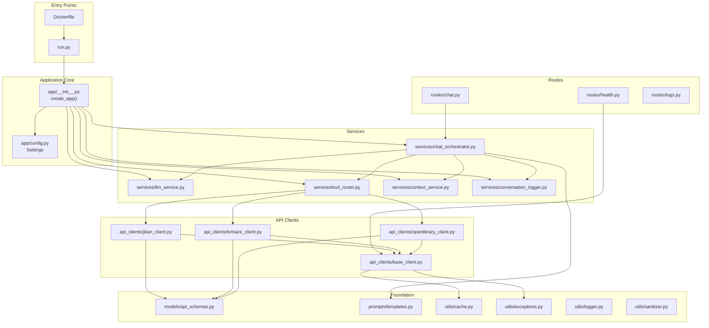

# EntertainBot — Project Structure

## Directory Layout

```
chat-bot-rag/
├── app/                          # Main application package
│   ├── __init__.py               # Flask app factory (create_app)
│   ├── config.py                 # Pydantic Settings configuration
│   │
│   ├── api_clients/              # External API client layer
│   │   ├── __init__.py
│   │   ├── base_client.py        # Abstract base with retry, cache, rate-limit
│   │   ├── jikan_client.py       # Jikan API v4 (MyAnimeList)
│   │   ├── tvmaze_client.py      # TV Maze API
│   │   └── openlibrary_client.py # Open Library API
│   │
│   ├── services/                 # Core business logic
│   │   ├── __init__.py
│   │   ├── chat_orchestrator.py  # Central brain — conversation loop
│   │   ├── llm_service.py        # OpenRouter/Gemini communication
│   │   ├── tool_router.py        # Maps LLM tool calls → API methods
│   │   ├── context_service.py    # ChromaDB RAG — vector memory
│   │   └── conversation_logger.py # JSON interaction logging
│   │
│   ├── models/                   # Data models
│   │   ├── __init__.py
│   │   ├── api_schemas.py        # Pydantic models (13 schemas)
│   │   ├── requests.py           # Request validation (ChatRequest)
│   │   └── responses.py          # Response models
│   │
│   ├── prompts/                  # LLM configuration
│   │   ├── __init__.py
│   │   └── templates.py          # System prompt + 13 tool definitions
│   │
│   ├── routes/                   # Flask blueprints
│   │   ├── __init__.py
│   │   ├── chat.py               # GET / · POST /chat · POST /chat/clear
│   │   ├── health.py             # GET /health
│   │   └── logs.py               # GET /logs
│   │
│   ├── middleware/               # Request pipeline
│   │   ├── __init__.py
│   │   ├── request_id.py         # UUID per request for tracing
│   │   └── error_handlers.py     # Global JSON error responses
│   │
│   ├── utils/                    # Shared utilities
│   │   ├── __init__.py
│   │   ├── cache.py              # TTL-based LRU cache
│   │   ├── exceptions.py         # Custom exception hierarchy
│   │   ├── logger.py             # Structlog setup
│   │   └── sanitizer.py          # Input sanitization
│   │
│   ├── static/                   # Frontend assets
│   │   ├── css/style.css         # Synthwave terminal theme
│   │   └── js/chat.js            # Chat logic + streaming animation
│   │
│   └── templates/
│       └── index.html            # Main UI template
│
├── tests/                        # Test suite
│   ├── test_api_clients/         # API client tests
│   ├── test_services/            # Service layer tests
│   └── test_models/              # Model validation tests
│
├── docs/                         # Documentation (this folder)
│   ├── system-design.md          # Architecture overview
│   ├── control-flow.md           # Request lifecycle & flows
│   ├── api-reference.md          # REST & tool API reference
│   ├── project-structure.md      # This file
│   └── configuration-guide.md    # Environment variable reference
│
├── data/                         # Runtime data (gitignored)
│   └── chromadb/                 # ChromaDB vector store persistence
│
├── logs/                         # Runtime logs (gitignored)
│   └── conversations/            # JSON conversation logs
│
├── Dockerfile                    # Multi-stage Docker build
├── docker-compose.yml            # Container orchestration
├── requirements.txt              # Python dependencies
├── run.py                        # App entry point
├── .env                          # Environment variables (gitignored)
├── .env.example                  # Example env template
├── .gitignore                    # Git ignore rules
└── README.md                     # Project README
```

---

## Module Dependency Graph



---

## Layer Architecture

The application follows a strict **layered architecture** where each layer only depends on the layer below it:

```
┌──────────────────────────────────────────────┐
│              Routes (Blueprints)              │  HTTP request/response
│         chat.py · health.py · logs.py         │
├──────────────────────────────────────────────┤
│            Middleware / Pipeline              │  Request ID, error handling,
│     request_id.py · error_handlers.py         │  input sanitization
├──────────────────────────────────────────────┤
│              Services Layer                   │  Business logic
│  ChatOrchestrator · LLMService · ToolRouter   │
│  ContextService · ConversationLogger          │
├──────────────────────────────────────────────┤
│             API Client Layer                  │  External communication
│  BaseAPIClient → Jikan · TVMaze · OpenLibrary │
├──────────────────────────────────────────────┤
│              Foundation Layer                 │  Shared utilities
│  Models · Config · Cache · Exceptions · Logger│
└──────────────────────────────────────────────┘
```

---

## Key Design Patterns

| Pattern | Where | Purpose |
|---|---|---|
| **Application Factory** | `app/__init__.py` | Deferred app creation for testing/config flexibility |
| **Service Layer** | `app/services/` | Encapsulate business logic, separate from HTTP |
| **Strategy Pattern** | `ToolRouter` | Map function names to implementations dynamically |
| **Template Method** | `BaseAPIClient` | Shared HTTP behavior, subclasses add parsing |
| **Repository Pattern** | `ContextService` | Abstract ChromaDB storage behind clean API |
| **Singleton** | `get_settings()` | Cache-once configuration loading |
| **Builder** | `ConversationHistory` | Incrementally construct message arrays |
