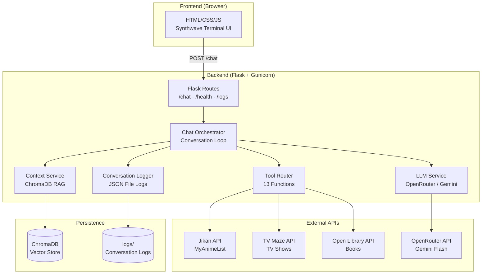
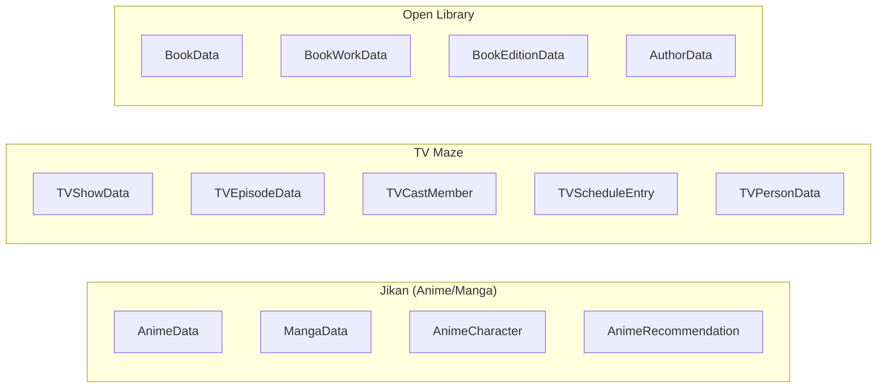
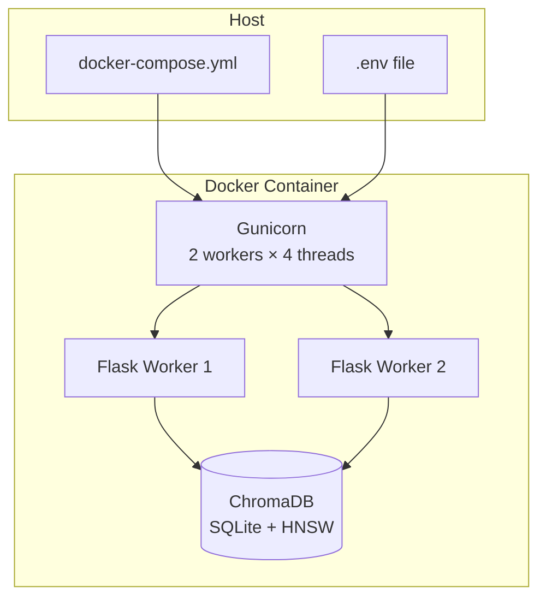

# EntertainBot — System Design Document

## 1. Overview

EntertainBot is an AI-powered **Retrieval-Augmented Generation (RAG)** chatbot that serves as an expert assistant for anime, manga, TV shows, and books. It combines a **Large Language Model** (Google Gemini Flash via OpenRouter) with live data from three external APIs and a **vector database** (ChromaDB) for semantic conversation memory.

### Design Goals

| Goal | Approach |
|---|---|
| **Rich, accurate answers** | LLM + live API data (never fabricates facts) |
| **Multi-step reasoning** | Iterative tool-calling loop (up to 5 rounds) |
| **Conversation memory** | Per-session history + ChromaDB vector retrieval |
| **Production resilience** | Retry, rate-limit, cache, structured logging |
| **Container-ready** | Docker + Gunicorn multi-worker deployment |

---

## 2. High-Level Architecture



---

## 3. Component Details

### 3.1 Frontend Layer

| Component | File | Purpose |
|---|---|---|
| HTML | `app/templates/index.html` | Synthwave terminal UI: ASCII header, sidebar, command cards, CRT scanlines |
| CSS | `app/static/css/style.css` | Neon color palette, neo-brutalist design, zero border-radius, glow effects |
| JS | `app/static/js/chat.js` | Message send/receive, streaming typing animation, session management |

**Key behaviors:**
- Character-by-character streaming animation with blinking block cursor
- Auto-resizing textarea with Shift+Enter for newlines
- Session ID persisted in `localStorage` across page reloads
- Markdown rendering via `marked.js`
- Mobile-responsive sidebar with hamburger toggle

### 3.2 Flask Application (`app/__init__.py`)

Uses the **Application Factory** pattern (`create_app()`):

```
create_app()
├── Load config (Pydantic Settings)
├── Setup structured logging (structlog)
├── Init middleware (request ID, error handlers)
├── Init CORS
├── Init services (API clients, LLM, orchestrator, ChromaDB)
├── Startup validation (API health checks)
└── Register blueprints (chat, health, logs)
```

All services are stored on `app.config` and accessed via `current_app` in routes.

### 3.3 Chat Orchestrator (`app/services/chat_orchestrator.py`)

The **central brain** of the application. Manages:

- **Per-session conversation histories** (in-memory dict, keyed by session ID)
- **Conversation loop** with iterative tool calling (up to `MAX_TOOL_ITERATIONS = 5`)
- **Context injection** from ChromaDB before each LLM call
- **Conversation logging** (JSON files for debugging/analytics)
- **Session cleanup** (TTL-based expiry of idle sessions)

### 3.4 LLM Service (`app/services/llm_service.py`)

Handles all communication with OpenRouter:

- **Chat completions** with tool/function definitions
- **Response parsing** — extracts text content or tool calls from JSON
- **Retry logic** with exponential backoff for transient failures
- **Rate limit handling** (429 responses with `Retry-After`)
- **ConversationHistory** class — manages message arrays with smart trimming

### 3.5 Tool Router (`app/services/tool_router.py`)

The bridge between LLM function calls and API clients:

- Maps **13 tool function names** → `(client, method, arg_mapping)` tuples
- Handles argument name translation (LLM names → client parameter names)
- Serializes results (Pydantic models → JSON strings) for the LLM
- Wraps execution with error handling

### 3.6 API Clients

All three clients inherit from `BaseAPIClient`, which provides:

| Feature | Implementation |
|---|---|
| **HTTP requests** | `httpx` async-compatible client |
| **Retry** | Exponential backoff, retryable status codes (429, 500, 502, 503, 504) |
| **Rate limiting** | Per-client minimum delay between requests |
| **Caching** | TTL-based in-memory LRU cache for GET responses |
| **Health checks** | Used by `/health` endpoint |

| Client | API | Functions |
|---|---|---|
| `JikanClient` | Jikan v4 (MyAnimeList) | `search_anime`, `get_anime_by_id`, `search_manga`, `get_manga_by_id`, `get_top_anime`, `get_season_anime`, `get_anime_characters`, `get_anime_recommendations`, `get_top_manga` |
| `TVMazeClient` | TV Maze | `search_shows`, `get_show_with_details`, `get_episode_by_number`, `get_schedule` |
| `OpenLibraryClient` | Open Library | `search_books`, `get_edition_by_isbn`, `search_authors` |

### 3.7 Context Service / RAG (`app/services/context_service.py`)

Implements the **Retrieval** part of RAG using ChromaDB:

- **Storage**: Each Q&A interaction is stored as a vector embedding
- **Embedding Model**: `all-MiniLM-L6-v2` (runs locally, ~80MB, no API key needed)
- **Retrieval**: Cosine similarity search with configurable threshold
- **Filtering**: Per-session or cross-session search
- **Multi-worker safety**: Init with retry + exponential backoff to handle SQLite race conditions

### 3.8 Conversation Logger (`app/services/conversation_logger.py`)

Writes detailed JSON logs for every interaction:

```json
{
  "session_id": "abc-123",
  "timestamp": "2025-02-28T22:00:00Z",
  "user_message": "Tell me about Naruto",
  "tool_calls": [
    {"name": "search_anime", "args": {"query": "Naruto"}, "result_summary": "Found 5 results"}
  ],
  "assistant_response": "Naruto is a legendary anime...",
  "duration_ms": 3200
}
```

---

## 4. Data Models

All API responses are normalized into **Pydantic models** (`app/models/api_schemas.py`):



**Benefits:**
- Type safety with full validation
- Consistent field naming across different API formats
- `model_dump(exclude_none=True)` for clean serialization

---

## 5. Error Handling

Custom exception hierarchy with global Flask error handlers:

```
ChatBotError (base, 500)
├── APIClientError (502)
│   ├── APIRateLimitError (429)
│   └── APITimeoutError (504)
├── LLMServiceError (502)
│   └── LLMRateLimitError (429)
├── ToolExecutionError (500)
└── InputValidationError (422)
```

All errors are caught by the global handler and returned as:
```json
{ "success": false, "error": { "message": "...", "code": 500 } }
```

---

## 6. Middleware

| Middleware | File | Purpose |
|---|---|---|
| **Request ID** | `app/middleware/request_id.py` | Generates UUID per request, binds to structlog context |
| **Error Handlers** | `app/middleware/error_handlers.py` | Global JSON error responses for all HTTP and custom errors |
| **CORS** | Flask-CORS | Allows cross-origin requests to `/chat`, `/health` |

---

## 7. Configuration

Centralized via **Pydantic Settings** (`app/config.py`):

- Loads from `.env` file with full validation and type coercion
- Cached singleton via `@lru_cache`
- Validators for API keys, URLs, log levels
- Covers: Flask config, LLM settings, API URLs, rate limits, HTTP client, logging, sessions, cache, ChromaDB

See [Configuration Guide](./configuration-guide.md) for full variable reference.

---

## 8. Deployment Architecture



| Aspect | Detail |
|---|---|
| **Base Image** | `python:3.11-slim` (multi-stage build) |
| **Process Manager** | Gunicorn (2 workers, 4 threads, 120s timeout) |
| **Security** | Non-root `appuser`, no unnecessary packages |
| **Health Check** | Docker HEALTHCHECK against `/health` every 30s |
| **Restart Policy** | `unless-stopped` |
| **Port** | 5000 (mapped to host) |

---

## 9. Security Considerations

| Area | Implementation |
|---|---|
| **Input Sanitization** | `sanitize_user_input()` strips HTML/scripts, enforces length limits |
| **Non-root Container** | Dedicated `appuser` in Docker |
| **Secret Management** | API keys via `.env` file (not in code), validated on startup |
| **CORS** | Restricted to `*` for `/chat` and `/health` only |
| **Error Masking** | Internal errors return generic messages, details only in server logs |

---

## 10. Observability

| Signal | Tool | Detail |
|---|---|---|
| **Structured Logs** | structlog | JSON format in production, console in dev |
| **Request Tracing** | Request ID middleware | UUID per request, bound to all log entries |
| **Health Checks** | `/health` endpoint | Tests all 3 API clients + LLM, reports ChromaDB stats |
| **Conversation Logs** | JSON files in `logs/conversations/` | Full interaction trace with tool calls and durations |
